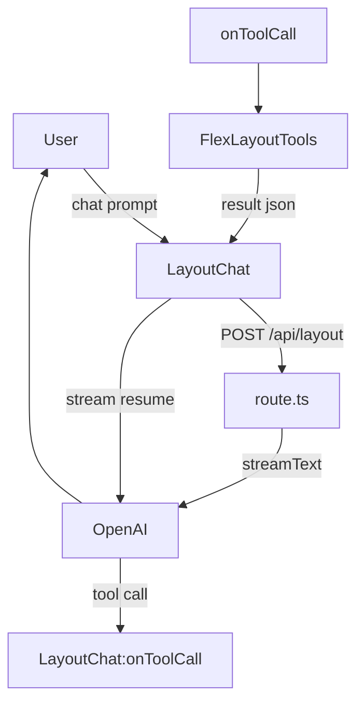

# FlexLayout × AI Agent — Quick Reference 📑

## 1 · Big Picture



* **`route.ts`** – server-side endpoint.
  - Registers *client* tools but never executes them.
  - Streams each LLM step; returns response immediately to avoid dead-locks.

* **`LayoutChat.tsx`** – UI + `useChat`.
  - Handles `onToolCall`, runs helpers from **`flexLayoutTools.ts`**, then returns **clone-safe** JSON.

* **`flexLayoutTools.ts`** – pure helpers that mutate the single FlexLayout **Model** held in `FlexLayoutContainer`.
  - Each helper returns `{ success, message }` (no live `Model` object — avoids `structuredClone` errors).

---

## 2 · Tool Lifecycle

| Phase            | Who          | Code Path                    | Notes                                         |
| ---------------- | ------------ | ---------------------------- | --------------------------------------------- |
| **Prompt**       | user         | `LayoutChat` → `useChat`     | UI collects text                              |
| **LLM stream**   | server       | `route.ts`                   | `streamText({ tools, messages })`             |
| **Tool call**    | LLM → client | `useChat` fires `onToolCall` | Receives `{ toolCallId, toolName, args }`     |
| **Exec helper**  | client       | `flexLayoutTools.*`          | Mutates `Model`; returns **plain JSON**       |
| **Send result**  | client → LLM | return value of `onToolCall` | Must be serialisable (`structuredClone`-safe) |
| **Final answer** | LLM → user   | streamed to UI               | Ends with a short user-visible summary        |

---

## 3 · Debug Recipe

```ts
// route.ts — per-step insight
onStepFinish(({ stepType, toolCalls, toolResults, usage }) =>
  console.log(stepType, toolCalls, toolResults, usage));

// LayoutChat.tsx
console.log('🔧 toolCall', toolCall);
console.log('✅ result', result);
```

- If you see **“unknown tool undefined”** → your `onToolCall` param is the wrapper object; destructure `{ toolCall }`.
- If you hit **`DataCloneError`** → strip non-cloneable objects (DOM nodes, FlexLayout `Model`) from the result.

---

## 4 · Common IDs & Helpers

```ts
import { getAvailablePaneIds, getAvailableTabIds } from '@/lib/agents/flexLayoutTools';

const panes = getAvailablePaneIds(model); // tabset IDs
const tabs  = getAvailableTabIds(model);  // [{ id, name, paneId }]
```

- **Tab names ≠ tabset IDs**  
  `splitPane` mutates tabsets, so the *target* must ultimately resolve to a **tabset ID**.

---

## 5 · Extending Tools

- Add new client-side capability → export a `tool()` descriptor in **`flexLayoutClientTools.ts`**.
- Implement its effect in **`flexLayoutTools.ts`** and wire it in `LayoutChat.tsx`’s switch.
- Remember to return clone-safe plain objects only.

---

*Last updated: 2025-06-22*
